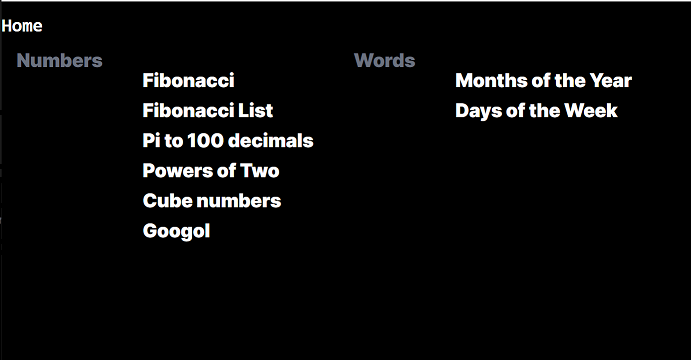
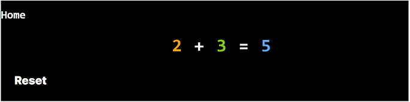
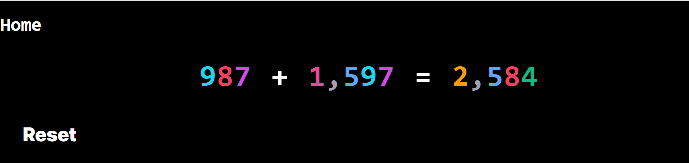
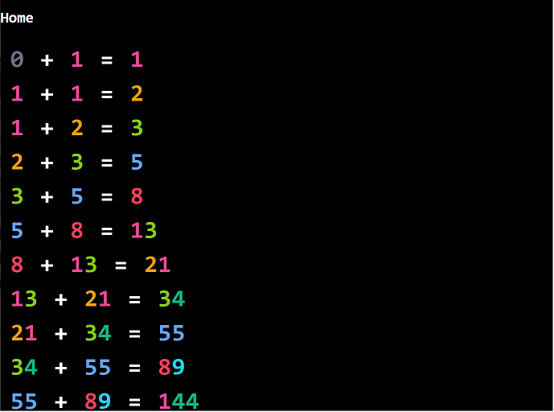
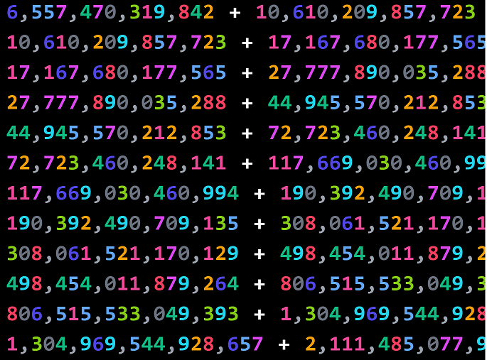
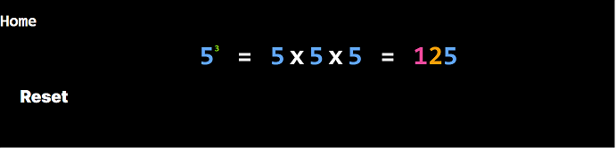
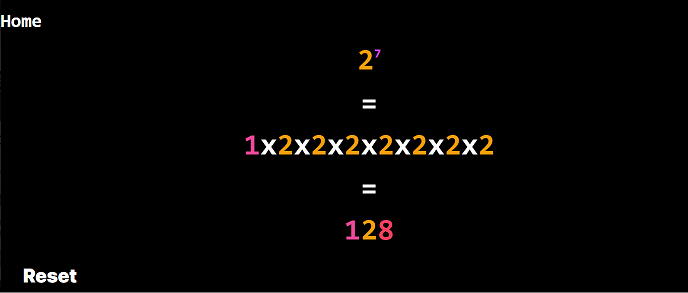
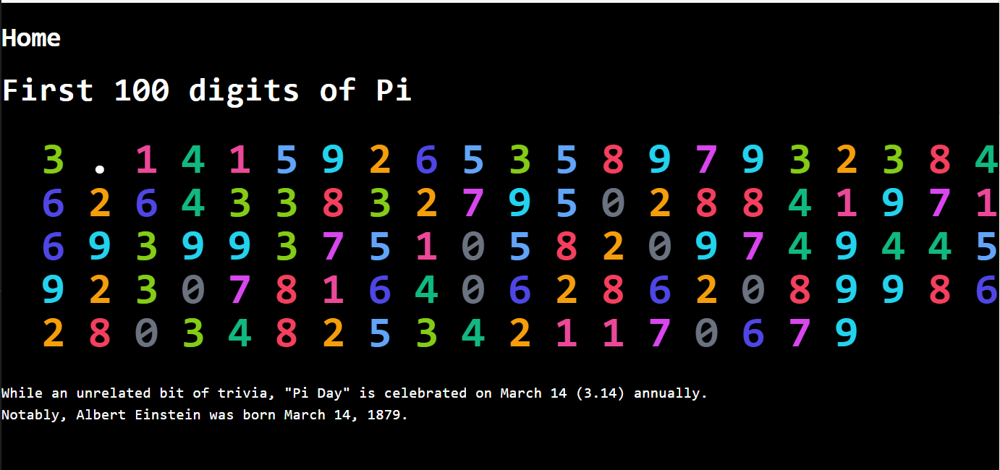
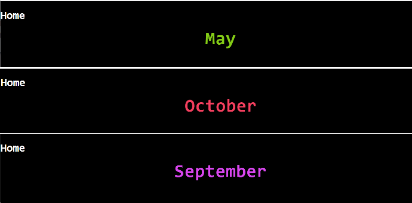
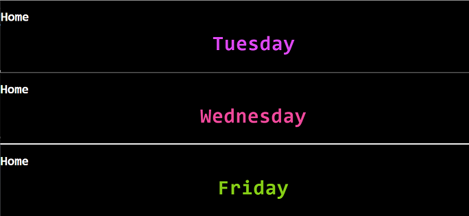

# Numbrella

Numbrella is a web-based app for use with tablets and smartphones allowing children to explore interesting numbers, patterns, sequences, and mathematics beyond their age ([Hypernumeracy](https://literallyausome.com.au/autism/hyperlexia-and-hypernumeracy/#:~:text=Hypernumeracy%20is%20known%20as%20'hyperlexia,like%20hyperlexia%20does%20with%20letters.)).

Screenshots can be found at the [end of this file](#screenshots).

# App Instructions

* Click on any number to proceed to next in sequence
* Touch can be used to allow scrolling of large numbers or zooming in/out.
* Tested in Dark Mode on iPad.
* :warning: Photosensitive users should be aware that clicking may introduce flashes between sequences. Rapid clicking may cause repeated flashing.

# Getting Started

## Prerequisites

* **PowerShell**
  * [Install PowerShell 7.3 or greater](https://learn.microsoft.com/en-us/powershell/scripting/install/installing-powershell-on-windows?view=powershell-7.3)
    * Install using MSI.
    * Check the following install options in addition to any default options already selected for install:
      * Add 'Open here' context menus to Explorer
      * Add 'Run with PowerShell 7' context menu for PowerShell files
* **Node.js**
  * [Node LTS 18.17.0](https://nodejs.org/dist/v18.17.0/) [Windows x64 Installer](https://nodejs.org/dist/v18.17.0/node-v18.17.0-x64.msi)
  * Check the install option for Additional Node Tools.
* **Next.js**
  * [Installation](https://nextjs.org/docs/getting-started/installation)

## One-Time actions (already performed)

* $> `npm init`
* $> `npm install next@latest react@latest react-dom@latest`
* $> `npm install create-next-app@latest --save`
* $> `npx create-next-app@latest`
* $> `npm install decimal.js`

## To Run Locally

* `npn run dev`

# Technical Reference

## React

* [Starting a new project](https://react.dev/learn/start-a-new-react-project)

## Next.js

* :star: [Next.js Docs](https://nextjs.org/docs)
* [Static Exports](https://nextjs.org/docs/app/building-your-application/deploying/static-exports)
  > Since Next.js supports this static export, it can be deployed and hosted on any web server that can serve HTML/CSS/JS static assets.
  * Unsupported Features:
    * rewrites in next.config.js
    * redirects in next.config.js
    * headers in next.config.js
    * Middleware
    * Incremental Static Regeneration
* Passing state between pages
  * Querystring: [useSearchParams](https://nextjs.org/docs/app/api-reference/functions/use-search-params)
* Lessons Learned:
  * Avoid `next/router` and use `next/navigation` instead. See: [App Router Migration (from Pages to App)](https://nextjs.org/docs/pages/building-your-application/upgrading/app-router-migration#step-5-migrating-routing-hooks)

## Tailwind CSS

* [Home](https://tailwindcss.com/)
* [Docs](https://tailwindcss.com/docs/installation)

## TypeScript

* [Iterators & Generators](https://www.typescriptlang.org/docs/handbook/iterators-and-generators.html)
* [Modules](https://www.geeksforgeeks.org/how-to-declare-a-module-in-typescript/)
* [Dictionary Type](https://www.carlrippon.com/typescript-dictionary/)

# Ideas:

* Calculus, limits
* Geometry
* Trigonometry
* [Names of large polygons](https://www.mathsisfun.com/geometry/polygons.html)
* [Giroux Studio Large Numbers series](https://www.youtube.com/watch?v=vq2BxAJZ4Tc&list=PLUZ0A4xAf7nkaYHtnqVDbHnrXzVAOxYYC)
* [list of mathematical shapes](https://en.wikipedia.org/wiki/List_of_mathematical_shapes)
  * [List of 2D Geometric shapes](https://en.wikipedia.org/wiki/List_of_two-dimensional_geometric_shapes)
  * [List of polygons (2D), polyhedra (3D), and polytopes](https://en.wikipedia.org/wiki/List_of_polygons,_polyhedra_and_polytopes)
  * [List of uniform polyhedra](https://en.wikipedia.org/wiki/List_of_uniform_polyhedra)
* [Names of large numbers](https://simple.wikipedia.org/wiki/Names_of_large_numbers)
* Special Dates, Holidays, Celebrity/Scientist/Academic birthdays

# Screenshots

## Home/Main Page

## Fibonacci, Single

## Fibonacci, further in the sequence

## Fibonacci as a list

## Fibonacci list continues to the first 75 iterations of the sequence

## Cube Numbers

## Powers of 2

## Pi to 100 decimals

## Words: Months of the Year

## Words: Days of the Week

