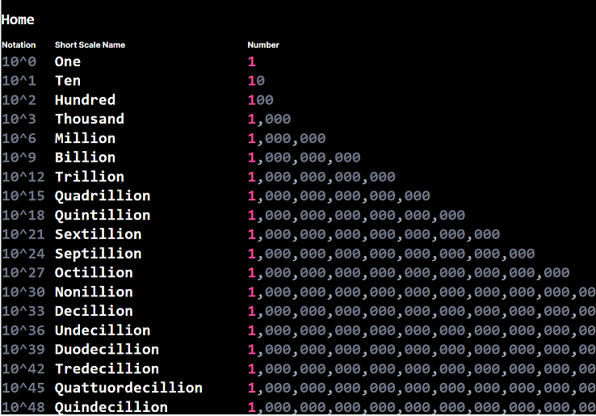

# Numbrella

Numbrella is a web-based app for use with tablets and smartphones allowing children to explore interesting numbers, patterns, sequences, and mathematics beyond their age ([Hypernumeracy](https://literallyausome.com.au/autism/hyperlexia-and-hypernumeracy/#:~:text=Hypernumeracy%20is%20known%20as%20'hyperlexia,like%20hyperlexia%20does%20with%20letters.)).

Screenshots can be found at the [end of this file](#screenshots).

# App Instructions

* Click on any number to proceed to next in sequence
* Touch can be used to allow scrolling of large numbers or zooming in/out.
* Tested in Dark Mode on iPad.
* :warning: Photosensitive users should be aware that clicking may introduce flashes between sequences. Rapid clicking may cause repeated flashing.


# Getting Started

## Prerequisites

* **PowerShell**
  * [Install PowerShell 7.3 or greater](https://learn.microsoft.com/en-us/powershell/scripting/install/installing-powershell-on-windows?view=powershell-7.3)
    * Install using MSI.
    * Check the following install options in addition to any default options already selected for install:
      * Add 'Open here' context menus to Explorer
      * Add 'Run with PowerShell 7' context menu for PowerShell files
* **Node.js**
  * [Node LTS 18.17.0](https://nodejs.org/dist/v18.17.0/) [Windows x64 Installer](https://nodejs.org/dist/v18.17.0/node-v18.17.0-x64.msi)
  * Check the install option for Additional Node Tools.
* **Next.js**
  * [Installation](https://nextjs.org/docs/getting-started/installation)

## One-Time actions (already performed)

* $> `npm init`
* $> `npm install next@latest react@latest react-dom@latest`
* $> `npm install create-next-app@latest --save`
* $> `npx create-next-app@latest`

## To Run Locally

First, run the development server:

```bash
npm run dev
# or
yarn dev
# or
pnpm dev
```

Open [http://localhost:3000](http://localhost:3000) with your browser to see the result.

You can start editing the page by modifying `app/page.tsx`. The page auto-updates as you edit the file.

This project uses [`next/font`](https://nextjs.org/docs/basic-features/font-optimization) to automatically optimize and load Inter, a custom Google Font.

To run prod:

* `npm run build`
* `npm run start`

Above commands have also been created as PowreShell scripts:

* `.\run-dev.ps1`
* `.\run-prod.ps1`

# Technical Reference

## React

* [Starting a new project](https://react.dev/learn/start-a-new-react-project)

## Next.js

* :star: [Next.js Docs](https://nextjs.org/docs)
* [Static Exports](https://nextjs.org/docs/app/building-your-application/deploying/static-exports)
  > Since Next.js supports this static export, it can be deployed and hosted on any web server that can serve HTML/CSS/JS static assets.
  * Unsupported Features:
    * rewrites in next.config.js
    * redirects in next.config.js
    * headers in next.config.js
    * Middleware
    * Incremental Static Regeneration
* Passing state between pages
  * Querystring: [useSearchParams](https://nextjs.org/docs/app/api-reference/functions/use-search-params)
* Lessons Learned:
  * Avoid `next/router` and use `next/navigation` instead. See: [App Router Migration (from Pages to App)](https://nextjs.org/docs/pages/building-your-application/upgrading/app-router-migration#step-5-migrating-routing-hooks)

## Tailwind CSS

* [Home](https://tailwindcss.com/)
* [Docs](https://tailwindcss.com/docs/installation)

## TypeScript

* [Iterators & Generators](https://www.typescriptlang.org/docs/handbook/iterators-and-generators.html)
* [Modules](https://www.geeksforgeeks.org/how-to-declare-a-module-in-typescript/)
* [Dictionary Type](https://www.carlrippon.com/typescript-dictionary/)


# Deployment

* [Deploy Next.js Hybrid website to Azure Static Web Apps](https://learn.microsoft.com/en-us/azure/static-web-apps/deploy-nextjs-hybrid#enable-standalone-feature)
  * In `next.config.js` enable `standalone` feature:
  ```javascript
  module.exports ={
      output:"standalone",
  }
  ```
* [Deploy static-rendered Next.js websites on Azure Static Web Apps](https://learn.microsoft.com/en-us/azure/static-web-apps/deploy-nextjs-static-export?tabs=azure-pipelines)
* :warning: Deploying to Azure Static Sites may result in error: `The size of the function content was too large. The limit for this Static Web App is 104857600 bytes`
  * package.json modified to force removal of cache during build.
    * Builds should happen using Git Bash now instead of PowerShell, or call `npm run psbuild` to run a build using PowerShell, which omits the cache removal step.
  * See following link for further details.
    * [Github: Azure Static Web Apps, The size of the function content was too large.](https://github.com/Azure/static-web-apps/issues/1034)
* See also: [Provisioning Azure Resources](#provisioning-azure-resources)
* [Custom Domains](https://learn.microsoft.com/en-us/azure/static-web-apps/custom-domain)

# Provisioning Azure Resources

## One-Time Environment Setup (Manual Steps)

Scripts below assume that developer is deploying to DEV environment. If deploying to other environments, all references to the resource group will change.

[azcli: Get Started with Azure CLI](https://docs.microsoft.com/en-us/cli/azure/get-started-with-azure-cli#how-to-sign-into-the-azure-cli)

### Step 1: login to az cli

```
az login
```

### Step 2: Set active subscription

[azcli: Managing multiple subscriptions with AZ CLI](https://docs.microsoft.com/en-us/cli/azure/manage-azure-subscriptions-azure-cli)

Lists all subscriptions and sets a specific one. Useful if user has access to multiple subscriptions (i.e., Corporate, personal, MDN, etc.)
```
az account show --output table
az account subscription list --output table
az account set --subscription "<subscriptionid>"
az account show --output table
```

[azcli: Create Resource Group](https://docs.microsoft.com/en-us/cli/azure/group?view=azure-cli-latest#az-group-create)

```
az group create -l canadacentral -n "rgnumbrella"
```

# Ideas:

* Calculus, limits
* Geometry
* Trigonometry
* [Names of large polygons](https://www.mathsisfun.com/geometry/polygons.html)
* [Giroux Studio Large Numbers series](https://www.youtube.com/watch?v=vq2BxAJZ4Tc&list=PLUZ0A4xAf7nkaYHtnqVDbHnrXzVAOxYYC)
* [list of mathematical shapes](https://en.wikipedia.org/wiki/List_of_mathematical_shapes)
  * [List of 2D Geometric shapes](https://en.wikipedia.org/wiki/List_of_two-dimensional_geometric_shapes)
  * [List of polygons (2D), polyhedra (3D), and polytopes](https://en.wikipedia.org/wiki/List_of_polygons,_polyhedra_and_polytopes)
  * [List of uniform polyhedra](https://en.wikipedia.org/wiki/List_of_uniform_polyhedra)
* [Names of large numbers](https://simple.wikipedia.org/wiki/Names_of_large_numbers)
* Special Dates, Holidays, Celebrity/Scientist/Academic birthdays

# Screenshots

## Home/Main Page


## Fibonacci, Single


## Fibonacci, further in the sequence


## Fibonacci as a list


## Fibonacci list continues to the first 75 iterations of the sequence

:point_up: Touch to scroll and zoom the viewport to view larger numbers.


## Cube Numbers


## Powers of 2


## Pi to 100 decimals


## Names of Large Numbers



## Words: Months of the Year


## Words: Days of the Week


